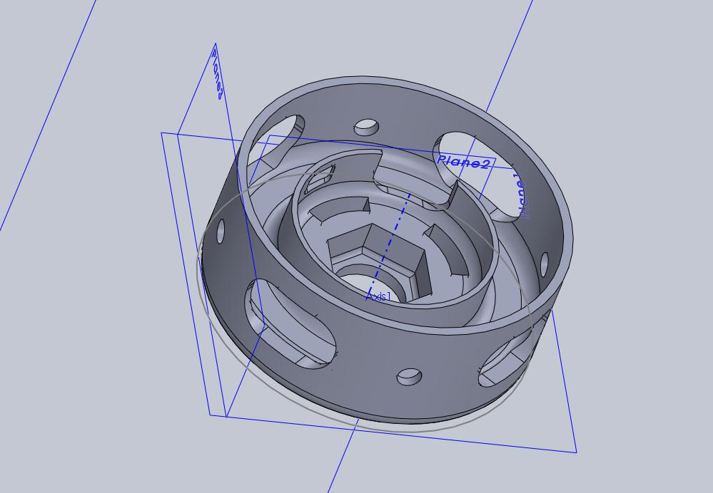
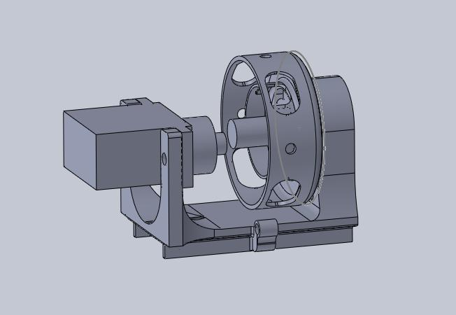
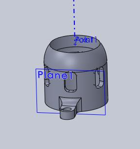

# LucidVR-EasyPrint

## Description

Open 3D designs for the LucidVR glove project that are designed to be easier to print and use less filament.

I ran into numerous issues when trying to print the standard LucidVR 4.0 and 4.1 designs, and because the Solidworks files weren't available I reimplemented those designs and made changes intended to improve them. My designs printed far more reliably on my printer (Robo 3D R1+ w/ PLA @ 190°C, 0.4mm nozzle, heated bed at 60°C) and require something like 25% less filament. They also removed points of failure I had, like the snap cover not working, thicker walls on the part of the tensioner that retains the spring, and more fillets for general strength improvements.

## Parts

### Tensioner and Cover

This part replaces "Tensioner_GreenPot.STL" and "SpoolCover_open.STL"

When I tried to print those designs the snap interface would get distorted and the nozzle of my older printer would hit the part itself, causing it to distort or break free from the print bed. The snap interface itself was also thin and fragile and it seemed unnecessary to have it separated into two parts.

This design integrates the cover into the tensioner and just requires the "HapticSpool.STL" to be placed on top.

### New slide mount 

This part replaces "GreenPotSLideHolder_Proto4.1.STL" (and previous versions). It fits the Tensioner and Cover in this repo and uses less filament

### End caps with no overhangs

This part replaces "Proto3_EndCap.STL"

The stock end caps would peel away from my heated bed and had large overhangs that didn't seem necessary.

